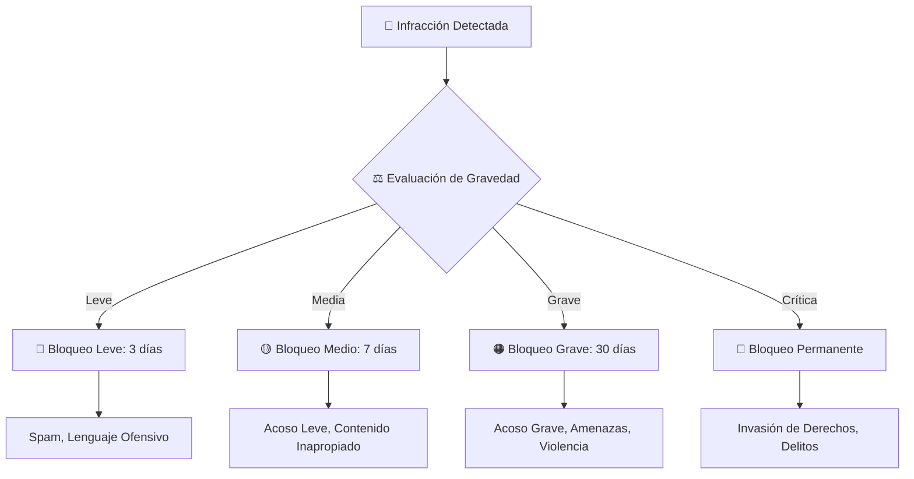

# ⚖️ C8L AGENT v20.0 — GUARDIÁN DE LA COMUNIDAD

## Sistema de Bloqueos por Gravedad



## 📊 Tabla Comparativa de Bloqueos

| Aspecto | 🔵 3 Días | 🟡 7 Días | 🟠 30 Días | 🔴 Permanente |
|---------|-----------|-----------|-----------|---------------|
| Duración | 3 días | 7 días | 30 días | ∞ |
| Gravedad | Leve | Media | Grave | Crítica |
| Chat Público | ❌ | ❌ | ❌ | ❌ |
| Juegos | ❌ | ❌ | ❌ | ❌ |
| Sala de Canto | ❌ | ❌ | ❌ | ❌ |
| Lives | ❌ | ❌ | ❌ | ❌ |
| Casino | ❌ | ❌ | ❌ | ❌ |
| Bandos | ❌ | ❌ | ❌ | ❌ |
| Perfil | ✅ | ❌ | ❌ | ❌ |
| Contenido | ✅ | ✅ | ❌ | ❌ |
| Mensajes Privados | ✅ | ✅ | ❌ | ❌ |
| Apelación | ✅ | ✅ | ✅ | ❌ |
| Revisión Humana | ❌ | ✅ | ✅ | ✅ |
| Bloqueo IP | ❌ | ❌ | ❌ | ✅ |
| Reincidencia | →7d | →30d | →Perm | — |

## 📋 Catálogo Completo (25 Infracciones)

| # | Categoría | Infracción | Gravedad | Días | Bot |
|---|-----------|-----------|----------|------|-----|
| 1 | Spam | Publicidad no autorizada | Leve | 3 | ✅ |
| 2 | Spam | Mensajes repetitivos | Leve | 3 | ✅ |
| 3 | Spam | Enlaces maliciosos | Media | 7 | ✅ |
| 4 | Lenguaje | Lenguaje ofensivo | Leve | 3 | ✅ |
| 5 | Lenguaje | Discurso de odio | Grave | 30 | ✅ |
| 6 | Lenguaje | Incitación a la violencia | Crítica | ∞ | ✅ |
| 7 | Acoso | Acoso verbal | Media | 7 | ✅ |
| 8 | Acoso | Acoso sexual | Grave | 30 | ✅ |
| 9 | Acoso | Acoso psicológico | Grave | 30 | ✅ |
| 10 | Acoso | Acoso colectivo (manada) | Crítica | ∞ | ✅ |
| 11 | Amenazas | Amenazas de muerte | Crítica | ∞ | ✅ |
| 12 | Amenazas | Amenazas daño físico | Grave | 30 | ✅ |
| 13 | Violencia | Apología violencia | Grave | 30 | ✅ |
| 14 | Violencia | Contenido violento explícito | Crítica | ∞ | ✅ |
| 15 | Suplantación | Suplantación identidad | Crítica | ∞ | ✅ |
| 16 | Suplantación | Suplantación streamer | Crítica | ∞ | ✅ |
| 17 | Fraude | Estafa a usuarios | Crítica | ∞ | ✅ |
| 18 | Fraude | Manipulación juegos | Grave | 30 | ✅ |
| 19 | Derechos | Violación privacidad | Grave | 30 | ✅ |
| 20 | Derechos | Difusión datos personales | Crítica | ∞ | ✅ |
| 21 | Derechos | Violación derechos autor | Media | 7 | ✅ |
| 22 | Derechos | Uso indebido imagen | Grave | 30 | ✅ |
| 23 | Comunidad | Comportamiento tóxico | Media | 7 | ✅ |
| 24 | Comunidad | Sabotaje comunidad | Grave | 30 | ✅ |
| 25 | Comunidad | Incitación al odio | Crítica | ∞ | ✅ |

## 📱 Comandos de Telegram

```
/moderar [usuario] [infracción] [días]
/bloquear [usuario] [días]
/desbloquear [usuario]
/infracciones [usuario]
/reportar [usuario] [motivo]
/apelar [id]
/estado
/logs
/estadisticas
```

## 📂 Archivos del sistema

| Archivo | Función |
|---------|---------|
| `moderation/BotModeratorComplete.tsx` | Panel completo del Guardián |
| `moderation/ModerationPanel.tsx` | Panel de admin (v1) |
| `moderation/ReportButton.tsx` | Botón de reporte para usuarios |
| `lib/moderation/blockActions.ts` | Funciones de bloqueo (3d/7d/30d/perm) |
| `sql/moderation.sql` | SQL v1 (tablas básicas) |
| `sql/moderation_v2.sql` | SQL v2 (25 infracciones + funciones RPC) |

---

*C8L AGENT v20.0 — 22 de junio de 2026*
